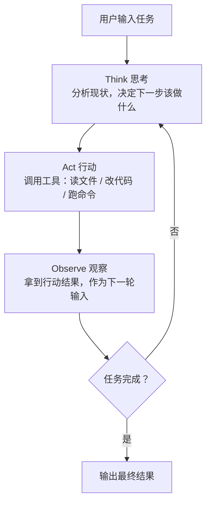

# 原理篇：搞懂 Agent、Agent Loop 与 Coding Agent

> [!TIP]
> 💡 **这是《Coding Agent 教程》的"原理篇"——整个系列的地基**。它不假设你是研发，也不假设你用过任何工具，目标是让任何人都能搞懂"Agent 到底是什么、它凭什么能干活"。
> - **完全没用过** AI coding 工具的同学：从头读，第一节会用一个你一定能想象到的画面带你入门。
> - **已经有coding agent经验** 的同学：可以直接跳到第三节「Agent Loop」，前面两节是概念铺垫。
> - 读完这篇，再去读「[基础篇](../02-%E5%9F%BA%E7%A1%80%E7%AF%87/%E4%BB%8E%E9%9B%B6%E5%BC%80%E5%A7%8B%E4%BD%BF%E7%94%A8coding-agent.md)」和「[进阶篇](../03-%E8%BF%9B%E9%98%B6%E7%AF%87/%E5%A6%82%E4%BD%95%E9%AB%98%E6%95%88%E7%8E%87%E4%BD%BF%E7%94%A8coding-agent.md)」会顺很多。

# 一、Agent 是什么：和 API 调用、Workflow 的区别

很多人第一次接触 AI Agent 时，会把它和"调一下 ChatGPT 的 API"或者"搭一个自动化工作流"搞混。但这三者有本质区别。

## 简单 API 调用：有大脑，没有手

你发一个请求，模型返回一段文字，结束。它不会主动去读你的代码、不会运行命令、不会决定下一步做什么。就像你问一个人"这个 bug 怎么修？"，他口头告诉你方案，但不会帮你动手改代码。

```text
你：帮我写一个邮件验证函数
API：返回一段代码字符串
结束。
```

整个过程是**单次请求-单次响应**，没有记忆，没有工具，没有自主行动。

## Workflow（工作流）：按剧本演的演员

工作流是**预先定义好的多步骤编排**。每一步做什么、调什么工具、走哪条分支，都是你用代码写死的。LLM 在里面只是一个"处理节点"，它不能决定流程该怎么走。

```text
步骤1：用户提交 PR → 步骤2：调 LLM 生成代码审查意见 → 步骤3：发到 Slack → 结束
```

每一步都是确定的。如果 PR 里有安全漏洞需要深入分析，工作流不会自己决定"我要多查几个文件"——因为流程里没写这一步。

## Agent：有大脑、有手、还有自主意志

Agent 的核心区别在于——**它自己决定下一步做什么**。它有工具（读文件、写代码、执行命令、搜索网页），有推理能力，而且能根据上一步的结果动态调整行动。

```text
你：修复登录失败的 bug
Agent 自己决定：
  → 先运行测试看哪个失败了
  → 读错误日志
  → 搜索相关源文件
  → 读代码理解逻辑
  → 修改代码
  → 再次运行测试验证
  → 测试通过，任务完成
```

你没有告诉它该走哪几步，它**自己规划**、**自己执行**、**自己验证**。这正是第一节那个画面背后发生的事。

## 三者对比一览

| 维度 | 简单 API 调用 | 工作流（Workflow） | Agent |
|-|-|-|-|
| **执行模式** | 单次请求-响应 | 预定义的多步骤编排 | 自主决策的动态循环 |
| **决策权** | 无，仅生成文本 | 由代码路径预先决定 | LLM 自己决定下一步 |
| **工具使用** | 无 | 按预设流程调用 | 动态选择和组合工具 |
| **灵活性** | 固定输入输出 | 处理预定义场景 | 应对开放式任务 |
| **适用场景** | 简单问答、文本生成 | 结构明确的标准流程 | 步骤不可预测的复杂任务 |

# 二、Agent 怎么转起来：Agent Loop

上一节说 Agent"自己决定下一步"，那它具体是怎么一步步转起来的？答案就是一个不断重复的 **"思考 → 行动 → 观察"** 循环，直到任务完成。这就是 **Agent Loop**，也是整个 Agent 的心脏。

## 核心循环：Think → Act → Observe

这一模式源自 2022 年的 [ReAct 论文（Reasoning + Acting）](https://arxiv.org/abs/2210.03629)，核心思想是让 LLM 交替进行推理和行动：



**每一轮循环（turn）的流程：**

1. **接收输入**：模型收到用户提示、系统提示、工具定义和对话历史
2. **思考评估**：分析当前状态，决定是回复文本、还是调用工具、还是两者兼有
3. **执行工具**：如果决定调用工具，执行并收集结果
4. **循环判断**：如果还没完成，带着工具结果回到步骤 2；如果完成，返回最终结果

## 想再往里钻一层

这一节只讲了 Agent Loop 最基本的样子——**够用就好，不用一上来就啃细节**。

如果你想看它在真实代码里到底怎么实现（一次 API 调用长什么样、工具结果怎么塞回对话、并发怎么控制），可以继续读 「[Agent Loop 详解：10分钟搞懂 AI Agent 的主循环](agent-loop%E8%AF%A6%E8%A7%A3.md)」（本篇的深读延伸，⬅️很重要，建议不了解的同学都花 10 分钟读一下）。

# 三、Agent Loop 为什么强大，又有代价

理解了 Loop 的形状，还要理解它的"性格"——它为什么强，以及它强的代价是什么。这两点直接决定了你之后该怎么用好它。

## 为什么 Loop 很重要：自我纠错

Agent Loop 的关键价值在于**自我纠错能力**。如果第一次修改没有解决问题，Agent 会看到测试仍然失败，然后尝试不同的方案。这和人类开发者的工作方式非常相似：改代码 → 跑测试 → 看结果 → 继续改。

没有 Loop，AI 就只能"一锤子买卖"——给你一个答案，对不对全靠运气。有了 Loop，AI 可以像人一样迭代，直到真正解决问题。

## Loop 的代价：每一轮都在烧 token

但 Loop 不是没有成本的。**每一轮循环都在消耗 token**——Agent 需要把之前所有的对话历史（你的输入、它的思考、工具调用结果）都带入下一轮，这意味着：

- **上下文膨胀**：每多一轮 Loop，上下文就增长一截。一个 6 轮的 bug 修复，最后一轮的输入可能已经包含了前 5 轮的所有中间过程
- **成本累积**：更多的 token = 更多的 API 费用和更长的响应时间
- **质量下降**：当上下文塞满了中间过程的噪音，Agent 的推理质量会下降（这就是常说的"上下文腐烂"）

> [!IMPORTANT]
> 🎁 **"让 Agent 少走弯路"比"让 Agent 多迭代几次"更高效**。一个精准的 Prompt 让 Agent 3 轮完成任务，远好过一个模糊的 Prompt 让 Agent 跌跌撞撞跑了 15 轮。这也正是「进阶篇」的核心主线：写好 Prompt（减少不必要的 Loop）+ 管理好上下文（让每轮 Loop 更高效）。

# 四、Coding Agent：Agent 的一种专用形态

前面讲的都是"通用 Agent"的原理。而你平时打交道最多的 Cursor、Claude Code，其实是 Agent 的一个**专用形态**——Coding Agent。

Coding Agent（编码智能体）就是**专门为软件开发任务设计的 AI Agent**。它把上面说的 Agent Loop 能力，配上一套编程相关的工具（读写文件、运行测试、Git 操作、搜索代码等），变成了一个能独立完成编码任务的助手。第一节那个"自己修 bug"的画面，本质上就是一个 Coding Agent 在跑它的 Loop。

## Coding Agent 的工具箱

不管是哪个产品，Coding Agent 的核心能力都来自它的工具集。以 Claude Code 为例：

| 工具类别 | 具体能力 |
|-|-|
| **文件操作** | 读取文件、编辑代码、创建新文件 |
| **搜索** | 按模式查找文件、用正则搜索内容、探索代码库 |
| **执行** | 运行 shell 命令、启动服务器、运行测试、使用 Git |
| **网络** | 搜索网页、获取文档、查找错误信息 |
| **代码智能** | 查看类型错误、跳转定义、查找引用 |

## 三大产品形态

同样是 Coding Agent，按"它住在哪里、你从哪个入口用它"，分成三种主流形态：

**① IDE 集成式**——以 Cursor、Windsurf 为代表：

- AI 深度嵌入编辑器，边看代码边改，文件树 / diff / 报错 / Git 状态都看得见
- 可视化反馈强、不容易迷路，适合日常编码和需要即时反馈的场景，对非研发 / 半研发最友好

**② 桌面 App / Agent App 式**——以 Codex App、Claude Code Desktop、Devin Desktop 为代表：

- 不在编辑器里逐行改，而像一个"工作台"：你新建任务 → Agent 自己执行 → 给你 diff / 结果 → 你审批
- 任务化、可视化、本地环境成本低，天然适合多 Agent 并行和"派工单"式协作，对非研发也很友好

**③ CLI 终端式**——以 Claude Code、Codex CLI 为代表：

- 纯命令行交互，无 GUI 束缚，本地文件控制力和自主性最强
- 适合大型重构、自动化流程、CI/CD 集成，上限最高，更偏研发 / 进阶用户

> [!TIP]
> 💡 **一句话记忆：IDE 适合"边看边改"，App 适合"派任务、管 Agent"，CLI 适合"深度执行、本地控制"。**

值得注意的是，主流工具正在**三端合一**——Claude Code、Codex 如今都同时提供 CLI、IDE 插件、桌面 App 多个入口，你完全可以按场景切换：用 CLI 跑执行、用 IDE 做 review、用 App 管任务。

## 主流产品对比（选型参考）

> [!NOTE]
> 😆 推荐coding agent与安装&注册教程（周度更新）：

| 产品 | 类型 | 核心模型 | 核心特点 | 最适合 |
|-|-|-|-|-|
| **Claude Code** | CLI / IDE / 桌面 App | Claude Sonnet/Opus | 最接近底层模型能力，工具集全面，支持 1M token 超长上下文，脚本化强，可集成 CI/CD | 终端重度用户、大型代码库重构、自动化流程 |
| **Codex** | CLI / IDE / 桌面 App | GPT-6.1 Sol | 开源可定制，沙箱隔离执行，权限模式（Ask for approval / Approve for me / Full access） | 重视开源和安全隔离、想深度定制 Agent |
| **Cursor** | AI IDE（VS Code Fork）/桌面 App | 多模型可选 | Tab 补全业界最强，Cmd+K 内联编辑，Agent 模式，VS Code 插件生态兼容 | VS Code 用户无缝迁移、日常编码主力工具 |
| **Windsurf** | AI IDE（VS Code Fork） | 多模型可选 | Cascade Agent 系统，Flows 混合模式，实时上下文感知 | 预算敏感、快速原型开发 |

> codex app教程推荐（最推荐）：<https://www.bilibili.com/video/BV1Nd596vEyU/>
>
> cursor教程推荐（也推荐）：<https://cursor.com/cn/docs/get-started/quickstart>
>
> Claude code近期不推荐，太容易被封了