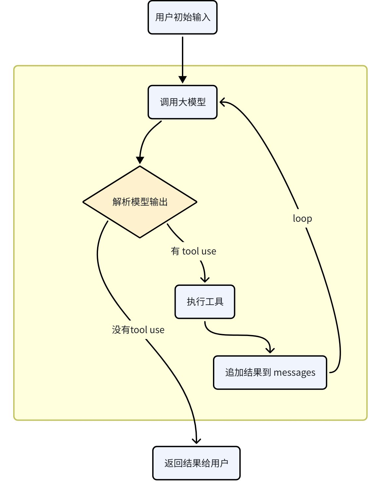

# Agent Loop 详解：10分钟搞懂 AI Agent 的主循环

## Agent 主循环流程图

> 所有coding agent都遵循这个循环⬇️



**一句话理解：** 用户说一句话 → 丢给大模型 → 模型要么直接回答你（循环结束），要么说"我要用个工具"（继续循环）→ 执行工具，把结果塞回对话 → 再丢给大模型……如此反复，直到模型觉得活干完了，直接回话。

## 前置知识1：先搞懂"一次 API 调用"长什么样

在理解 Agent Loop 之前，你需要先搞懂一个更基础的问题：**当你和 ChatGPT / Claude /Gemini 聊天时，每一轮对话背后，API 层面到底发生了什么？**

### 一个残酷的事实：模型没有记忆

大模型本身是**无状态的**。它不记得你上一句说了什么。每次 API 调用都是一次独立的"阅读理解考试"——你把**整篇对话记录**（包括之前所有轮次）一股脑塞给它，它读完，输出下一句回复。

所以你在 ChatGPT 里感受到的"它记得我之前说的话"，不是因为模型有记忆，而是**客户端（前端 / Agent 框架）把之前的对话历史全部塞进了每次请求的 messages 数组里**。

### 一次最简单的 API 调用

你第一次给模型发消息：

```JSON
{
  "model": "claude-sonnet-5-5",
  "messages": [
    { "role": "user", "content": "什么是递归？" }
  ]
}
```

模型返回：

```JSON
{
  "role": "assistant",
  "content": "递归是函数调用自身的编程技巧..."
}
```

就这么简单，一问一答，结束。

### 多轮对话：Chatbot 模式

当你接着问第二个问题时，客户端需要把**完整的对话历史**再发一遍：

```JSON
{
  "model": "claude-sonnet-5-5",
  "messages": [
    { "role": "user", "content": "什么是递归？" },
    { "role": "assistant", "content": "递归是函数调用自身的编程技巧..." },
    { "role": "user", "content": "能给个 Python 的例子吗？" }
  ]
}

```

模型返回：

```JSON
{
  "role": "assistant",
  "content": "当然，比如计算阶乘：\ndef factorial(n):\n    if n <= 1: return 1\n    return n * factorial(n - 1)"
}
```

**注意看**——第二次请求里，`messages` 数组包含了 3 条消息（第一轮的 user + assistant + 第二轮的 user）。模型不是"记住"了之前的对话，而是每次都**从头读了一遍完整的聊天记录**。

这就引出了一个关键问题：**对话越长，每次请求塞进去的内容就越多，token 消耗就越大**。这也是为什么 context window（上下文窗口）的大小这么重要。

```Plain Text
第 1 轮请求：[user]                           → 很短
第 2 轮请求：[user, assistant, user]           → 变长了
第 3 轮请求：[user, assistant, user, assistant, user] → 更长了
第 N 轮请求：... → 越来越长，直到撞上 context window 的天花板

```

> [!TIP]
> 💡 **一句话总结**：Chatbot 模式 = 客户端维护对话历史 + 每次请求把完整历史塞给模型。模型本身无状态，所有的"记忆"都靠 messages 数组。

## 前置知识2：Tool Calling（工具调用）是什么

理解了 Chatbot 模式之后，下一个关键概念就是 **Tool Calling**（也叫 Function Calling）。

### 普通 Chatbot 的局限

普通的 Chatbot 只能**说话**——你问它今天天气怎么样，它只能根据训练数据瞎猜，不能真的去查天气 API。你让它帮你改代码，它只能把"修改后的代码"打印在聊天窗口里，不能真的去改文件。

**它是一个只有嘴、没有手的助手。**

### Tool Calling：给模型装上"手"

Tool Calling 的核心思想很简单：

1. **你在 API 请求里额外传一个 tools 字段**，告诉模型"你有这些工具可以用"
2. **模型在回复时，可以选择输出一个特殊的结构化指令**，表示"我想调用某个工具"
3. **你的程序（Agent 框架）负责真正执行这个工具**，然后把结果返回给模型

模型自己并不能执行任何工具——它只是**输出一段 JSON 说"我想调用这个工具，参数是这些"**，真正动手的是你的代码。

### 一个完整的例子

假设你想让模型能查天气。你这样调用 API：

```JSON
{
  "model": "claude-sonnet-5-5",
  "tools": [
    {
      "name": "get_weather",
      "description": "查询指定城市的当前天气",
      "input_schema": {
        "type": "object",
        "properties": {
          "city": { "type": "string", "description": "城市名称" }
        },
        "required": ["city"]
      }
    }
  ],
  "messages": [
    { "role": "user", "content": "北京今天天气怎么样？" }
  ]
}

```

模型返回——注意，**它没有直接回答天气**，而是说"我要用工具"：

```JSON
{
  "role": "assistant",
  "content": [
    { "type": "text", "text": "我来查一下北京的天气。" },
    {
      "type": "tool_use",
      "id": "call_001",
      "name": "get_weather",
      "input": { "city": "北京" }
    }
  ]
}

```

你的程序看到 `tool_use`，就真的去调天气 API，拿到结果后，把结果塞进 messages 继续发给模型：

```JSON
{
  "messages": [
    { "role": "user", "content": "北京今天天气怎么样？" },
    {
      "role": "assistant",
      "content": [
        { "type": "text", "text": "我来查一下北京的天气。" },
        { "type": "tool_use", "id": "call_001", "name": "get_weather", "input": { "city": "北京" } }
      ]
    },
    {
      "role": "user",
      "content": [
        {
          "type": "tool_result",
          "tool_use_id": "call_001",
          "content": "北京，晴，28°C，湿度 45%"
        }
      ]
    }
  ]
}

```

模型这次看到了工具的结果，终于可以正常回答了：

```JSON
{
  "role": "assistant",
  "content": "北京今天晴天，气温 28°C，湿度 45%，适合出门遛弯。"
}

```

### Tool Calling 的本质

整个过程可以这样理解：

```Plain Text
模型本身能做的事：              模型 + Tool Calling 能做的事：
┌──────────────┐              ┌──────────────┐
│   读文本     │              │   读文本     │
│   生成文本   │              │   生成文本   │
│              │              │   搜索文件   │ ← 通过工具
│              │              │   读写代码   │ ← 通过工具
│              │              │   执行命令   │ ← 通过工具
│              │              │   查询 API   │ ← 通过工具
└──────────────┘              └──────────────┘
   只有嘴                        有嘴有手

```

> [!TIP]
> 💡 **一句话总结**：Tool Calling = 模型用结构化 JSON 表达"我想干什么" + 你的程序负责真正去干 + 把结果喂回给模型。模型是大脑，工具是四肢，Agent 框架是连接大脑和四肢的神经系统。

## 把两个概念串起来：从 Chatbot 到 Agent

现在你已经理解了两个核心概念：

1. **Chatbot 模式**：每次请求带上完整对话历史，模型无状态
2. **Tool Calling**：模型可以输出"调工具"的指令，由框架执行

**Agent = Chatbot + Tool Calling + 一个 while 循环。**

普通 Chatbot 是一问一答就结束。Agent 则是：收到模型回复后，检查有没有 `tool_use`——如果有，执行工具、把结果追加到 messages，再调一次模型；如果没有，循环结束。

这就是上面那张流程图的全部内容。接下来，让我们通过一个具体的案例，看看每一轮循环中，messages 数组到底是怎么"长大"的。

## 实战案例：删掉老板不要的按钮

> **场景：** 产品经理小王跑过来说："首页那个'一键暴富'按钮，老板说太离谱了，删掉。"

> 你打开 Claude Code，输入："帮我把首页上那个'一键暴富'按钮删掉"

下面我们来逐轮拆解，看看 Agent Loop 里每次 LLM 调用的 **输入** 和 **输出** 到底长什么样。

### 第 1 轮：LLM 调用 — "一键暴富在哪？"

**输入（发给大模型的完整请求）：**

```JSON
{
  "system": "你是一个编程助手，可以通过工具来完成用户的编程任务...",
  "tools": [
    {
      "name": "Grep",
      "description": "在文件内容中搜索正则表达式模式",
      "input_schema": {
        "type": "object",
        "properties": {
          "pattern": { "type": "string", "description": "要搜索的正则表达式" },
          "path": { "type": "string", "description": "搜索的目录或文件路径" }
        }
      }
    },
    {
      "name": "Read",
      "description": "读取指定文件的内容",
      "input_schema": {
        "type": "object",
        "properties": {
          "file_path": { "type": "string" },
          "offset": { "type": "integer" },
          "limit": { "type": "integer" }
        }
      }
    },
    {
      "name": "Edit",
      "description": "对文件进行精确的字符串替换",
      "input_schema": {
        "type": "object",
        "properties": {
          "file_path": { "type": "string" },
          "old_string": { "type": "string" },
          "new_string": { "type": "string" }
        }
      }
    },
    {
      "name": "Bash",
      "description": "执行 shell 命令"
    }
  ],
  "messages": [
    {
      "role": "user",
      "content": "帮我把首页上那个'一键暴富'按钮删掉"
    }
  ]
}

```

> [!IMPORTANT]
> 🎁 **注意 tools 字段！** 这是 Agent 的"工具箱清单"——每次调用 LLM 都会带上。模型看到这个列表，才知道自己能干什么。没有这个列表，模型就只能说话，不能动手。后面轮次这个字段一直存在，我们省略不写了。

**输出（大模型返回）：**

```JSON
{
  "role": "assistant",
  "content": [
    {
      "type": "text",
      "text": "好的，我先搜一下'一键暴富'这个按钮在哪个文件里。"
    },
    {
      "type": "tool_use",
      "name": "Grep",
      "input": { "pattern": "一键暴富", "path": "src/" }
    }
  ]
}

```

**Agent 框架解析：** 检测到 `tool_use` → 还没完活，继续循环！

**执行工具：**

```Plain Text
执行: Grep(pattern="一键暴富", path="src/")

实际动作: 在 src/ 目录下递归搜索包含"一键暴富"的文件

```

**工具返回结果：**

```Plain Text
src/pages/Home.tsx:42:  <Button className='get-rich-btn'>一键暴富</Button>
```

**追加到 messages：** 框架把上面的结果包装成 `tool_result` 消息，塞进 messages 数组，准备发给下一轮 LLM 调用。

### 第 2 轮：LLM 调用 — "找到了，让我看看"

**输入（发给大模型的 messages）：**

```JSON
{
  "system": "你是一个编程助手...",
  "tools": [ ],
  "messages": [
    {
      "role": "user",
      "content": "帮我把首页上那个'一键暴富'按钮删掉"
    },
    {
      "role": "assistant",
      "content": [
        { "type": "text", "text": "好的，我先搜一下'一键暴富'这个按钮在哪个文件里。" },
        { "type": "tool_use", "id": "call_001", "name": "Grep", "input": { "pattern": "一键暴富" } }
      ]
    },
    {
      "role": "user",
      "content": [
        {
          "type": "tool_result",
          "tool_use_id": "call_001",
          "content": "src/pages/Home.tsx:42:  <Button className='get-rich-btn'>一键暴富</Button>"
        }
      ]
    }
  ]
}

```

> 注意看！messages 变长了——之前的对话和工具结果全部带上了，这就是为什么每轮循环上下文都在膨胀。

**输出（大模型返回）：**

```JSON
{
  "role": "assistant",
  "content": [
    {
      "type": "text",
      "text": "找到了，在 src/pages/Home.tsx 第 42 行。我先读一下上下文，确认删除范围。"
    },
    {
      "type": "tool_use",
      "name": "Read",
      "input": { "file_path": "src/pages/Home.tsx", "offset": 35, "limit": 20 }
    }
  ]
}

```

**Agent 框架解析：** 又有 `tool_use` → 继续循环！

**执行工具：**

```Plain Text
执行: Read(file_path="src/pages/Home.tsx", offset=35, limit=20)

实际动作: 读取 Home.tsx 文件的第 35 到 55 行

```

**工具返回结果：**

```Plain Text
35| <div className='hero-section'>
36|   <h1>欢迎回来</h1>
37|   <p>今天也是充满希望的一天</p>
38|   <div className='action-buttons'>
39|     <Button onClick={handleStart}>开始工作</Button>
40|     <Button onClick={handleReport}>查看报表</Button>
41|     {/* 老板的梦想按钮 */}
42|     <Button className='get-rich-btn' onClick={handleGetRich}>一键暴富</Button>
43|   </div>
44| </div>

```

**追加到 messages：** 框架把上面的文件内容包装成 `tool_result`，塞进 messages。

### 第 3 轮：LLM 调用 — "看清楚了，动手删！"

**输入（发给大模型的 messages）：**

```JSON
{
  "system": "你是一个编程助手...",
  "tools": [ ],
  "messages": [
    {
      "role": "user",
      "content": [
        {
          "type": "tool_result",
          "tool_use_id": "call_002",
          "content": "35| <div className='hero-section'>..."
        }
      ]
    }
  ]
}

```

**输出（大模型返回）：**

```JSON
{
  "role": "assistant",
  "content": [
    {
      "type": "text",
      "text": "看到了，第 41-42 行是那个按钮和它的注释。一起删掉。"
    },
    {
      "type": "tool_use",
      "name": "Edit",
      "input": {
        "file_path": "src/pages/Home.tsx",
        "old_string": "     {/* 老板的梦想按钮 */}\n     <Button className='get-rich-btn' onClick={handleGetRich}>一键暴富</Button>",
        "new_string": ""
      }
    }
  ]
}

```

**Agent 框架解析：** 又有 `tool_use` → 继续循环！

**执行工具：**

```Plain Text
执行: Edit(
  file_path="src/pages/Home.tsx",
  old_string="{/* 老板的梦想按钮 */}\n<Button className='get-rich-btn' onClick={handleGetRich}>一键暴富</Button>",
  new_string=""
)

实际动作: 找到这两行代码，替换为空字符串（即删除）

```

**工具返回结果：**

```Plain Text
文件已修改：src/pages/Home.tsx

```

**追加到 messages：** 框架把修改结果包装成 `tool_result`，塞进 messages。

### 第 4 轮：LLM 调用 — "删完了，收工！"

**输入（发给大模型的 messages）：**

```JSON
{
  "system": "你是一个编程助手...",
  "tools": [ ],
  "messages": [
    {
      "role": "user",
      "content": [
        {
          "type": "tool_result",
          "tool_use_id": "call_003",
          "content": "文件已修改：src/pages/Home.tsx"
        }
      ]
    }
  ]
}

```

**输出（大模型返回）：**

```JSON
{
  "role": "assistant",
  "content": [
    {
      "type": "text",
      "text": "已经删掉了首页上的「一键暴富」按钮（以及它上面那行充满梦想的注释）。修改在 src/pages/Home.tsx 第 41-42 行。\n\n老板的暴富梦，到此结束。"
    }
  ]
}

```

**Agent 框架解析：** 没有 `tool_use`，只有纯文本 → **循环结束！**

**无工具执行。直接把文本回复展示给用户。**

## 回顾：4 轮循环里到底发生了什么

| 轮次 | LLM 的思考 | 调用的工具 | 工具返回的结果 |
|-|-|-|-|
| 1 | "一键暴富"在哪个文件？搜一下 | Grep("一键暴富") | Home.tsx 第 42 行 |
| 2 | 找到了，看看上下文再删 | Read(Home.tsx, 35-55行) | 按钮在 action-buttons div 里 |
| 3 | 看清了，连注释一起删掉 | Edit(删除第41-42行) | 文件已修改 |
| 4 | 活干完了，汇报一下 | 无（纯文本回复） | — 循环结束 |

## 关键要点

### 1. 循环的"油门"和"刹车"

- **油门**：模型输出里包含 `tool_use` → 继续循环
- **刹车**：模型输出里只有纯文本 → 循环终止，返回结果

LLM 自己决定要不要踩油门。它觉得还需要更多信息或者还没干完活，就会调工具；觉得完事了，就直接说话。**这就是 Agent 和普通 API 调用的根本区别——LLM 自己控制循环何时结束。**

### 2. 上下文是一路膨胀的

每轮循环，之前所有的对话历史（用户输入 + 助手回复 + 工具结果）都会作为下一轮的输入发给大模型。这意味着：

- 第 1 轮：messages 里只有用户的一句话
- 第 4 轮：messages 里已经塞了 4 轮对话 + 3 次工具结果

这就是为什么**精准的 Prompt 比"让 Agent 多试几次"更高效** —— 每多一轮循环，上下文就胖一圈，成本高了，模型也可能被噪音干扰。

### 3. 工具结果伪装成"用户消息"

仔细看第 2 轮的输入——工具结果（`tool_result`）的 role 是 `"user"`，不是什么 `"tool"` 或 `"system"`。这是 Anthropic API 的设计：工具结果在协议层面是作为 user message 发送的，只是内容类型是 `tool_result`。对 LLM 来说，这就像是用户在"转述"工具的执行结果。