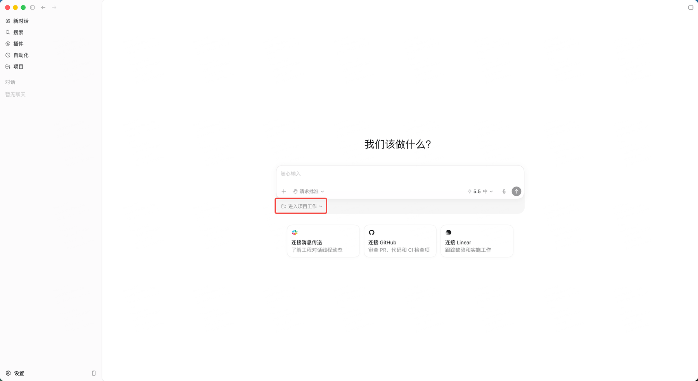
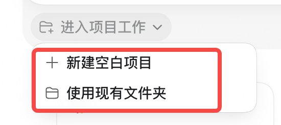
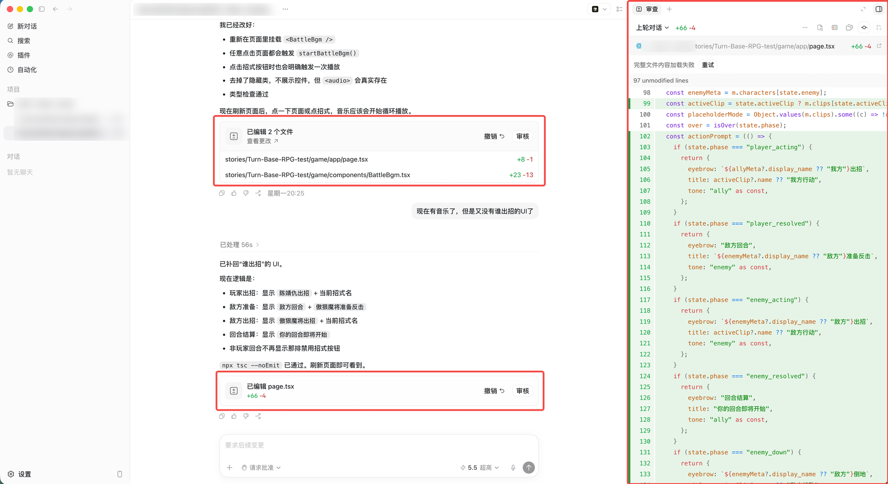

# 基础篇：从零开始使用 Coding Agent

> [!TIP]
> 💡 **这是《Coding Agent 教程》的"基础篇"——写给完全没用过coding agent的你。** 它不假设你会写代码，目标是让你看完就能真的上手用 Agent 帮自己干活。
> - 还没搞懂"Agent 到底是什么"的同学：建议先花 10 分钟读「[原理篇](../01-%E5%8E%9F%E7%90%86%E7%AF%87/Agent%E7%9A%84%E5%8E%9F%E7%90%86.md)」，再回来读这篇会更顺。
> - 已经会基本操作、想用得更高效的同学：读完这篇可以直接去看「[进阶篇](../03-%E8%BF%9B%E9%98%B6%E7%AF%87/%E5%A6%82%E4%BD%95%E9%AB%98%E6%95%88%E7%8E%87%E4%BD%BF%E7%94%A8coding-agent.md)」。
> - 全文以 **Codex App** 为主线举例（它上手最简单），换成 Cursor、Claude Code，思路完全一样。

这篇文档做两件事：先补齐几个"工程地基"概念——**项目与文件、版本管理、运行项目**；再用**三个真实任务**把这些概念实际用起来；最后讲一条**不能踩的隐私红线**。

你不需要会写代码。你需要的是搞懂几个词在说什么，然后敢动手。

# 一、项目与文件

你和 Agent 打交道，第一件要搞清楚的事是：**它在哪儿干活、对着哪些文件干活。** 这一章就讲这个。

## 项目就是一个文件夹

在 coding 的世界里，记住一个最朴素的等式：

> [!NOTE]
> ✅ **一个"项目" ＝ 一个文件夹。**

这个文件夹里装着这个项目的所有东西：文档、数据、图片、代码、配置——全在里面。你让 Agent 帮你做事，本质上就是把某个文件夹交给它，告诉它"这就是我们要弄的东西"。

在 Codex App 里，你新建一个任务时，**第一步就是选一个文件夹**作为工作目录。你选了哪个文件夹，Agent 就在那个范围里干活。

| 选择文件夹 | 新建项目（文件夹）/选择一个文件夹 |
| --- | --- |
|  | <br>新建空白项目其实是在/Users/users/Documents里帮你新建了一个文件夹 |

> [!TIP]
> 💡 **Agent 只能看见你交给它的那个文件夹。** 文件夹外面的东西，它默认看不到、也动不了（当然你可以给他full权限，这是后话了）。这既是它的工作边界，也是一道天然的安全护栏——所以你要养成习惯：**专门为一件事建一个文件夹，再把这个文件夹交给 Agent。**

## 路径与"当前目录"：Agent 在哪里干活

文件夹里会有子文件夹、子文件夹里还有文件。怎么准确地指出"我说的是哪一个文件"？靠**路径（path）**——你可以把它理解成文件的"门牌号"。

路径有两种写法：

| 类型 | 长什么样 | 类比 |
|-|-|-|
| **绝对路径** | `/Users/你/Documents/会议材料/周报.md`，从最顶上一层层写全 | 写完整地址："北京市朝阳区 XX 路 1 号 3 单元 502" |
| **相对路径** | `会议材料/周报.md`，相对"我现在所在的文件夹"来写 | 说"我楼下那家便利店" |

这里有个最容易让新手懵的概念——**"当前目录"（current directory）**：它指 Agent 此刻"站"在哪个文件夹里。所有相对路径，都是从这个"当前位置"算起的。

**你为什么要懂这个？** 因为当 Agent 说"找不到这个文件"，或者把新文件建到了一个奇怪的地方，**十有八九是它的"当前目录"和你以为的不一样。** 你不用会任何命令，只要会问一句、说一句就能纠正它：

```Plain
我们现在在哪个文件夹下操作？
请确保所有文件都建在 会议材料 这个文件夹里。
```

> 如果你需要拿到某个文件夹的路径，在mac上，你可以在Finder里选择某个文件通过option+command+c复制某个文件的路径

## 文件格式：纯文本 vs 富文本

文件名最后那个后缀（`.md`、`.txt`、`.csv`、`.docx`、`.pdf`）就是**文件格式**，它告诉电脑"这个文件该用什么方式打开"。对用 Agent 来说，你只要分清两大类：

| 格式 | 是什么 | 类别 | Agent 友好度 |
|-|-|-|-|
| **TXT** | 纯文字，没有任何排版 | 纯文本 | 😍 极友好 |
| **MD（Markdown）** | 纯文字 + 几个简单符号做排版 | 纯文本 | 😍 极友好 |
| **CSV** | 用逗号分隔的表格数据 | 纯文本 | 😍 极友好 |
| **DOCX（Word）** | 文字 + 字体颜色图片排版，打包压缩 | 富文本 | 😐 不太友好 |
| **PDF** | 排版固定的"打印件" | 富文本 | 😐 不太友好 |

两类的区别在于：

- **纯文本**：文件里**只有字**，用记事本打开就能看到全部内容。Agent 读写它又快又准。
- **富文本 / 打包格式**：除了字，还塞了字体、颜色、图片、排版，甚至是压缩打包的。Agent 要先"拆包"才能读，容易丢格式、读串。

> [!TIP]
> 💡 **给 Agent 的源材料，尽量用 md / txt / csv。** 手上如果是 Word、PDF，最省事的做法是直接对 Agent 说："把这个 docx 转成 markdown 再处理。"——它一句话就帮你转好了。

顺便说一下 **Markdown（.md）**：它就是"用几个简单符号给纯文本加排版"的写法——`#` 是标题、`-` 是列表、`**两个星号**` 是加粗。它既是纯文本（Agent 友好），又能排出好看的结构，所以 **Agent 的产出大多是 md 格式**。你不用专门学，看几次就懂了。MD是ai时代最适合agent读的格式。

# 二、版本管理与 Git

上一章解决"对着什么干活"，这一章解决一个更让人安心的问题：**它干坏了怎么办？**

## 什么是版本管理，本地用 Agent 为什么更要做

**版本管理**，就是给你的项目"自动留下各个时间点的快照"，让你任何时候都能翻回到过去某个版本。

其实你早就在手动做这件事了——你电脑里是不是躺着这样一串文件：

```Plain
方案.docx
方案_最终版.docx
方案_最终版2.docx
方案_真的最终版.docx
方案_最终版_这次真的.docx
```

这就是最原始、也最混乱的版本管理。Git 要做的，就是把这件事做得又干净又自动。

**为什么本地用 Agent，更要做版本管理？** 因为 Agent 会**一次动很多文件、而且手很快**。改对了皆大欢喜；可一旦改歪了，你需要能**一键回到它动手之前的样子**。没有版本管理，你就只能干瞪眼、一个个手动还原。

> [!IMPORTANT]
> 🎁 **把版本管理当成 Agent 的"后悔药"和"安全带"。** 有了它，你才敢放手让 Agent 大胆干。

## 用"游戏存档"理解 Git

> [!NOTE]
> ✅ **Git ＝ 你项目的"游戏存档系统"。**

玩游戏的时候你会怎么做？打大 Boss 之前，先**手动存个档**；万一团灭了，**读档重来**，回到存档那一刻，损失可控。

Git 就是给你的项目做这件事：

- 每当你做完一件事（比如"把会议文件整理完了"），就**存一个档**——这个动作叫 **commit（提交）**，存档时写一句话说明这个档是干嘛的，比如"存档点：会议文件整理完成"。
- 所有存档点排成一条线，叫**提交历史**。你随时可以**读档**，回到其中任意一个，整个项目就变回那一刻的样子。

把游戏术语和 Git 术语对一下，你就全懂了：

| 游戏里 | Git 里 | 在说什么 |
|-|-|-|
| 存一个档 | **commit（提交）** | 把当前状态永久记下来，存成一个点 |
| 一排存档点 | **提交历史** | 你走过的所有存档点，连成一条线 |
| 读档回到某个存档 | **回退 / 恢复** | 让项目变回过去某个时刻 |
| "如果当时走另一条路"，另存一条平行存档 | **branch（分支）** | 开一条不影响主线的平行线，试坏了也没事 |
| 把本地存档上传到云端备份 | **push（推送）** | 传到 GitHub 等云端，备份 / 给别人看 |
| 从云端下载存档 | **pull（拉取）** | 把云端最新的拿回本地 |

## 你只需要懂"状态"，命令交给 Agent

Git 有一堆命令（`add`、`commit`、`push`、`pull`、`branch`……），但**你几乎不用亲手敲它们**。你真正要懂的，只是——**此刻你的改动处在哪个"状态"**。

把"存一次档"拆成四步，你就知道改动会经过哪些状态：

| 状态 | 它在说什么 | 你心里只要会问 |
|-|-|-|
| **改了，还没存** | 你 / Agent 刚改完文件，还没决定要不要存进档 | "这些改动我满意吗？" |
| **暂存（add）** | 把这次想存进档的改动，先挑进"待打包"的篮子 | "哪些改动要存？" |
| **提交（commit）** | 正式存一个档，配一句说明，存档点永久记下 | "我要存档了，备注写啥？" |
| **推送（push）** | 把本地存档上传到云端备份 / 共享 | "要不要传到云端？"（个人本地练习常常不需要） |

至于**分支（branch），记一句话就够：想试个没把握的大改动，就让 Agent"开个新分支试试**"——相当于另存一条平行存档线，试坏了不影响主线，满意了再合并回去。

**在 Codex App 里具体怎么用？**

- Agent 每次改完文件，App 会给你一份 **diff（改动对照）**：哪几行加了、哪几行删了，红绿高亮一目了然。你**看过、点批准**，改动才真正落到文件上——这本身就是一道关卡。

> 在codex app里通过agent做了一些改动，codex会主动给你一个文件审核、撤销的区域⬇️，这就是通过git实现的
> 
> 

- 你完全可以直接用大白话指挥它做 Git 操作：

```Plain
先帮我把当前状态用 git 提交一下，备注"整理前存档"。
这次改坏了，帮我回到上一个提交。
这个改动有点大，开个新分支再做。
```

> [!TIP]
> 💡 **你不用记任何 Git 命令，只要能回答一个问题——"我现在是想存档（提交），还是想回到上一个档（回退）？"** 把"想干嘛"说出来，具体命令交给 Agent 敲。

> 还是建议大家可以学习更多git的教程，推荐两个教程
> 
> 视频：bilibili.com/video/BV1Hkr7YYEh8/?spm_id_from=333.337.search-card.all.click
> 
> 网页：https://liaoxuefeng.com/books/git/index.html

# 三、运行项目

前两章都是"静态"地摆弄文件。但有些项目——比如一个网页——是要"**跑起来**"才能看见效果的。这一章讲怎么把项目运行起来，以及一个关键心态：**看到报错别慌。**

## 项目基建：依赖与包管理

你做一个网页，**不用从零造按钮、表格、图表**。这些东西早有人造好了，打包成一个个现成模块（叫"**包**"，package）。你的项目"站在"这些包上面，它们就是项目的**依赖（dependencies）**。

负责"按清单把这些包装齐"的工具，叫**包管理器（package manager）**：

| 技术栈 | 包管理器 | 一句话 |
|-|-|-|
| **JavaScript**（一遍写网页用） | **npm**（配 Node.js） | `npm install` 就按项目清单把依赖全装好 |
| **Python**（通常用来写脚本用） | **pip** | `pip install 某个库` 装一个工具 |

这个时代，非研发想用 Agent 干活，基本认准两个技术栈就够了：

- **写网页 / 带前后端的小应用** → 用 **Next.js**（基于 JS，前后端一体，最省心）。
- **写脚本 / 处理数据 / 自动化** → 用 **Python**。

你**完全不用会写它们**——让 Agent 写、让 Agent 装。你只要知道这些词在说什么，听得懂 Agent 在干嘛就行。

**实际你会看到的画面**：Agent 说"我先 `npm install` 装一下依赖"，然后屏幕上哗哗滚一大堆下载日志，最后多出一个很大的 `node_modules` 文件夹。那就是装好的"积木仓库"，**又大又正常，别管它**。

> nextjs教程可以看：<https://www.bilibili.com/video/BV1jPvDBxE1C/>
>
> python可以学：<https://liaoxuefeng.com/books/python/introduction/index.html>  
> 当然，如何写这些代码并不关键，可以完全不去学习也可以使用

## 启动项目：localhost 与端口

依赖装好后，要用一条**启动命令**（比如 `npm run dev`）把项目跑起来。这条命令也是 Agent 替你跑。

跑起来后，Agent 会告诉你打开一个地址，长这样：`http://localhost:3000`。你可以在自己电脑上通过这个链接打开这个网页。拆开看：

- **localhost** ＝ "**这台电脑自己"。这个网页只在你电脑上跑，没有发到互联网上**，只有你能看到，专门用来本地预览。
- **3000** 是**端口号（port）**。

什么是**端口**？把你的电脑想象成一栋大楼，端口就是不同的**房间号**。不同的服务跑在不同房间里：网页常住 `3000` 号房，另一个服务可能住 `8000` 号房，互不打架。

> [!TIP]
> 💡 **看到 `localhost:3000` 别紧张**——它就是"在你自己电脑上预览这个网页"的地址。在浏览器里打开它，就能看到 Agent 给你做的东西。

## 报错不是失败，是信息

这是这一章最重要的一句话：

> [!NOTE]
> ✅ **红色的报错 ≠ 失败、搞砸了。它是程序在告诉你"哪里卡住了、为什么"。** 研发每天都在和报错打交道，这是正常工作的一部分，不是事故。

**你该怎么做？不用自己看懂报错。** 把报错（文字或截图）**原样丢回给 Agent**，说一句"报这个错了，帮我看看"。Agent 读报错、定位问题的能力比你强得多。

举个最常见的例子——**端口冲突**。报错里出现 `port 3000 is already in use` 或 `EADDRINUSE`，意思就是 `3000` 这个房间已经被别的程序占了。解法很简单，对 Agent 说：

```Plain
端口被占了，换个端口跑。
（或）把占用 3000 端口的程序关掉，再重新启动。
```

还有一个词你会经常见到——**日志（log）**：项目跑起来后，终端里持续滚动的那些文字就是日志，它在实时播报"我正在干嘛、有没有出错"。卡住的时候，把**相关的那几行**日志给 Agent 看就行。

> [!WARNING]
> 👺 **三句话总结：① 报错是信息，不是失败；② 原样把报错丢给 Agent；③ 只给相关的几行日志，别把整屏全倒进去**（为什么不能全倒？「进阶篇」会讲——别往 Agent 的上下文里拉屎 🐶）。

# 四、上手三个真实任务

> [!NOTE]
> 😆 **概念讲到这就够了，剩下的全靠练。** 下面三个任务**用同一套素材**，层层递进，分别把前三章实际用起来。看完就动手，比读十遍都管用。

开工前的准备：

1. **下载配套素材**`配套素材/` ⬇️，里面的 `会议材料/` 是一个虚构「晨读 App」团队 2026 年 3 月的一堆**乱七八糟的文件**（命名五花八门、格式混杂、堆在一起）。

📁 [配套素材/](配套素材/)（即本目录下的 `配套素材/` 文件夹）

1. **先复制一份再动手。** 把整个文件夹复制一份（比如改名 `配套素材-练习`），在副本上操作。原件留底，搞砸了随时重来——这就是上一章说的"可逆 / 备份"。
2. 全程以 **Codex App** 为例，换工具思路一样。

三个任务是连着的：

| 任务 | 练到哪一章 | 你会得到 |
|-|-|-|
| **A. 批量整理与重命名** | 第一章：项目与文件 | 一个结构清晰的文件夹 |
| **B. 总结成一份文档** | 第二章：版本管理与 Git | 一份《项目进展总览.md》 |
| **C. 做一个可视化网页** | 第三章：运行项目 | 一个能在浏览器里打开的看板 |

## 任务 A：批量整理与重命名文件

**目标**：把 `会议材料/` 里那堆乱命名、混在一起的文件，整理成清晰的结构。

**第一步，用 Codex App 打开**你复制出来的素材文件夹（选它做工作目录）。

**第二步，先让 Agent 摸清现状**，别急着动（这就是「进阶篇」说的"先 Explore 再动手"）：

```Plain
先别动任何文件。读一下当前文件夹里的所有文件，
告诉我里面都有什么、分别是什么内容、命名上有哪些问题。
```

**第三步，让它出方案，你确认后再动手**（Plan）：

```Plain
根据文件内容，帮我设计一个整理方案：
- 按「会议纪要 / 周报 / 数据 / 其他」分成几个子文件夹
- 文件名统一成"日期-标题"的格式，比如 2026-03-05-产品周会.md
先把方案列给我看，先别改。
```

**第四步，确认后执行**（Execute）：

```Plain
方案可以，开始整理。
另外把那份 招聘需求.docx 也转换成 markdown 再放进去。
```

**你会看到**：Agent 把要"改名 / 移动"的文件一条条列出来，Codex App 里的文件树跟着变清爽。整个过程里它在做的，正是第一章讲的事——对着**一个文件夹**工作、用**路径**把文件归位、把**富文本 docx 转成纯文本 md**。

> [!WARNING]
> 👺 **安全提示**：整理＝"移动 + 改名"，是真的动了你的文件。所以开工前**一定先复制一份原件**。万一整理乱了，删掉副本、从原件重新来过即可——这就是"可逆操作"给你的底气。

## 任务 B：把零散文件总结成一份文档

**目标**：让 Agent 读完所有材料，产出一份《项目进展总览.md》。这一任务里，我们顺手把**第二章的 Git** 用起来。

**第一步，先存个档**（把版本管理用起来）。在让 Agent 大改之前，先存一个安全点：

```Plain
在开始总结之前，帮我把现在整理好的状态用 git 提交一下，
备注"整理完成，准备做总结"。如果还没初始化 git，就先初始化。
```

你看，你没敲任何 Git 命令，只是表达了"**我想在这儿存个档**"。之后无论总结怎么改，你都能一键回到这个存档点。

**第二步，让它总结**（一次把要什么说清楚）：

```Plain
读 会议材料 里所有的会议纪要、周报、复盘、备忘和那份 kpi 数据，
帮我整理成一份《项目进展总览.md》，包含：
① 四周的时间线（每周发生了什么）
② 关键决策清单
③ 待办事项和它们各自的状态
④ KPI 趋势（新增、留存、收入的变化）+ 一句话小结
```

**第三步，一定要 review。** Agent 会犯错、甚至会"编"（这点「原理篇」讲过）。它产出后，**对照原始文件抽查几个关键数字和决策**，发现不对就具体指出来：

```Plain
KPI 那段，W12 的次周留存应该是 33%，你写成了 30%，改一下。
```

**万一越改越乱**，第二章的"后悔药"就派上用场了：

```Plain
这版总结改坏了，帮我回到刚才那个"整理完成"的提交。
```

> [!TIP]
> 💡 这一步你同时练了两件事：**把零散素材"提炼成成品"的迭代协作**（不是一次到位，而是来回改、逼近满意），以及**用 Git 存档 / 回退给自己兜底**。

## 任务 C：做一个网页把内容可视化

**目标**：基于前面的材料和总结，让 Agent **从零做一个能在浏览器里打开的网页**（用 Next.js），把"晨读 App"3 月的进展变成一个好看的小看板。这一次，你会真正经历"**运行一个项目**"的全过程。

**第一步，提需求**（一次说清楚要什么，别"许愿式"——这点「进阶篇」会专门讲）：

```Plain
用 Next.js 帮我在当前文件夹里新建一个网页项目，
做一个"晨读 App｜3 月进展看板"。
数据来源用 会议材料/kpi数据.csv 和我们刚生成的《项目进展总览.md》。
页面要包含：
- 顶部四个数字卡：最新一周的 新增 / 活跃 / 留存 / 收入
- 一条 KPI 周趋势折线图
- 一个按周排列的"关键决策"时间线
- 一个待办看板（按状态分列：已完成 / 进行中 / 待开始）
先把实现方案和要装的依赖列给我，再动手。
```

**第二步，让它装依赖、起服务。** 确认方案后，它会自动 `create-next-app`、`npm install` 装依赖、`npm run dev` 启动——你会看到屏幕哗哗滚日志，这都正常。

**第三步，打开 localhost。** 它会让你打开 `http://localhost:3000`，你就能在浏览器里看到网页了。

**第四步，遇到报错就丢回去。** 如果终端飘红、或页面打不开，把报错**原样**发给它："报这个错，帮我修。"端口被占就让它换个端口。

**第五步，边看边改**（迭代）。像指挥设计师一样来回调：

```Plain
折线图的图例挡住数据了，挪到右上角。
待办看板把"已完成"这一列放到最左边。
顶部数字卡的字再大一点，配色清爽些。
```

**你练到的第三章**：依赖与包管理（`npm install`）、启动项目（`npm run dev`）、localhost 与端口、报错是信息——全流程你**一行代码都没写**，但你清楚每一步在干嘛。

> [!NOTE]
> ✅ **到这里，你已经独立"跑起来"过一个真实项目了。** 这正是基础篇的终点，也是你敢用 Agent 去干更多事的起点。

# 五、一条不能踩的红线：隐私与数据

工具再好用，也有一条线不能踩。这一节最短，但最重要。

## 破除误解：本地跑 ≠ 数据没出去

很多人有个危险的误解：**"它在我电脑上跑 ＝ 数据没出去。"**

真相是：**动手操作**（改文件、跑命令）确实发生在你**本地**；但 Agent 之所以"**看得懂**"内容，靠的是**云端的大模型**——它读的东西，会被传到云端去"理解"（这点「原理篇」讲过：大脑在云端，手在本地）。

所以真正该问的，不是"它在哪儿跑"，而是——**哪些东西，根本不该让它碰。**

## 按部门的敏感清单

最直观的方式，是按部门列一份"敏感清单"：

| 部门 | 不该直接丢给 Agent 的东西 |
|-|-|
| **HR / 行政** | 身份证号、薪资、个人隐私、背景调查信息 |
| **财务 / 数据** | 未公开财报、账户 / 银行信息、合同金额 |
| **通用** | 密码、密钥、任何公司未公开的材料 |

> [!WARNING]
> 👺 **一个简单的自检判据**：这份材料如果出现在公司外网上，我会不会出事？会，就别原样丢给 Agent。