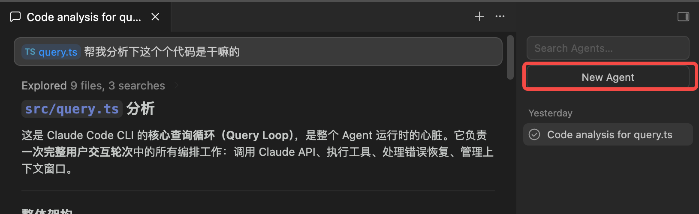
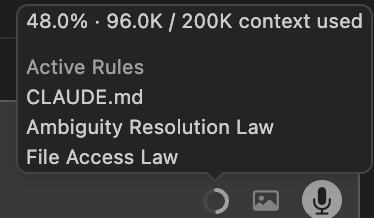

# 进阶篇：如何高效率使用 Coding Agent

> [!TIP]
> 💡 **这是《Coding Agent 教程》的"进阶篇"——适合任何已经有过ai coding agent工具经验的同学进行阅读。**
> - 如果你没有使用过任何ai coding agent工具，可以先去看看「[基础篇](../02-%E5%9F%BA%E7%A1%80%E7%AF%87/%E4%BB%8E%E9%9B%B6%E5%BC%80%E5%A7%8B%E4%BD%BF%E7%94%A8coding-agent.md)」和「[原理篇](../01-%E5%8E%9F%E7%90%86%E7%AF%87/Agent%E7%9A%84%E5%8E%9F%E7%90%86.md)」，上手体验一两周再来看进阶篇
> - 进阶篇虽然没有像基础篇一样给到一些测试题，但是也希望大家读完后，可以每个点都去试试，感受一下和原来的用法上的差别

基于基础篇和原理篇，高效率去使用Coding Agent就是做好两件事情：**写好给 Agent 的 Prompt** 和 **管理好上下文**。

还记得《原理篇》里讲的 Agent Loop 吗——Agent 的一切工作都发生在"思考 → 行动 → 观察"的循环里。所有高效使用 Agent 的技巧，本质上都在做两件事：

1. **给 Loop 一个更好的起点**（写好 Prompt）——让 Agent 从第一轮就走在正确的方向上，减少不必要的试错循环
2. **让 Loop 的每一轮都更高效**（管理好上下文）——确保 Agent 在每轮循环中都能看到高质量的信息，而不是被噪音淹没

这两件事看起来简单，但做好了能把 Agent 的效率提升数倍，做不好则会让你陷入反复纠正、越改越乱的困境。

# 一、写好 Prompt

## 1.1 不要许愿式 Prompt，要明白 Agent 的能力边界

**什么是许愿式 Prompt？**

许愿式 prompt 就是把一个模糊的期望甩给 Agent，期待它能读懂你的心。你可以试试和agent说：帮我做一个能快速到1亿 DAU的产品，看看效果怎么样🐶。

**许愿式 vs 有效式对比：**

| 许愿式（不要这样写） | 有效式（应该这样写） |
|-|-|
| "修复登录 bug" | "用户反馈 session 超时后登录失败，报 TypeError。请检查 src/auth/ 目录下的 token 刷新逻辑，写一个能复现问题的测试，然后修复它" |
| "给 foo.py 加测试" | "给 foo.py 写测试，覆盖用户未登录时的边界情况，不要用 mock" |
| "让 dashboard 好看点" | "\\[粘贴设计稿截图\\] 按照这个设计实现。完成后截图对比原稿，列出差异并修复" |
| "它不工作了，帮我修" | "运行 npm test 后第 42 行报 TypeError，这是bug信息：\\[粘贴\\]。请修复并验证" |
| "帮我赚 1 个亿" | - - ！ |

**Agent 的能力边界在哪？**

- Agent **能做的**：读写代码、运行命令、搜索信息、调试错误、重构代码、写测试、做 Git 操作
- Agent **做不好的**：需要大量业务领域知识的决策、涉及多团队协调的架构设计、没有明确成功标准的开放式任务
- Agent **不能做的**：帮你做产品决策、帮你和其他公司谈判、做超出代码范畴的事

> [!NOTE]
> ✅ **核心原则：你的 Prompt 越具体，Agent 需要猜的就越少，结果就越好。**

## 1.2 想清楚了再开始做：Explore → Plan → Execute

这是 **Anthropic/Cursor/Codex 官方均推荐的核心工作流**。每个agent工具都会有plan模式，就是为了这个流程而准备的，就像盖房子要先看地、画图纸、再动工一样，用 Coding Agent 也应该先探索、再计划、最后执行。

### 阶段一：Explore（探索）

进入计划模式（Plan Mode），让 Agent 只读文件、理解代码，**不做任何改动**。

```Plain Text
读一下 /src/auth 目录，帮我梳理当前是怎么处理 session 和登录的。
也看看环境变量是怎么管理密钥的。
```

**为什么要先探索？**

- 避免 Agent 在不了解现有代码的情况下瞎改
- 让 Agent 和你对代码库建立共同理解
- 发现你可能没注意到的依赖关系

### 阶段二：Plan（计划）

让 Agent 基于探索结果，输出一个详细的实施方案。

```Plain Text
我想加 Google OAuth 登录。基于你刚才看到的代码结构，
哪些文件需要改？session 流程会怎么变？请出一个计划。
```

**计划的价值：**

- 在动手之前对齐预期，避免做了一半发现方向不对
- 让你有机会审查方案，提出调整
- Agent 有了清晰的计划后执行效率更高

### 阶段三：Execute（执行）

确认计划没问题后，让 Agent 按计划编码并验证。

```Plain Text
按你的计划实现 OAuth 流程。给 callback handler 写测试，
运行测试套件，修复所有失败的测试。
```

### 实战示例：完整的三阶段流程

```Plain Text
# 阶段一：Explore
> 我想给 API 加一个 rate limiting 功能。先帮我看看现有的中间件结构，
  特别是 src/middleware/ 目录下的文件，以及 Express 的中间件注册方式。

# 阶段二：Plan
> 基于你看到的结构，给我出一个 rate limiting 的实现方案。
  要求：按 IP 限制，每分钟 100 次请求，超限返回 429。

# Agent 输出计划，你审查后确认

# 阶段三：Execute
> 按计划实现。写完后运行现有测试确保没有 break 任何东西，
  再给 rate limiter 本身写单元测试。
```

> [!TIP]
> 💡 **什么时候可以跳过计划？**
> **如果你能用一句话描述这个 diff，就可以跳过计划。** 比如"把这个变量名从 camelCase 改成 snake\\\_case"，直接做就行。
> 但以下场景一定要做计划：
> - 你不确定实现方案
> - 改动涉及多个文件
> - 你不熟悉要修改的代码

## 1.3 给 Agent 有明确指向性的内容

Agent 有能力搜索和探索代码库，但你直接告诉它该看哪里，能省去大量的搜索时间。**每一个具体的线索，都能让 Agent 少走弯路。**

### 六种给具体线索的方式

**1. 给文件路径**

```Plain Text
# 不好
"auth 模块有个 bug"

# 好
"src/auth/tokenRefresh.ts 第 42 行的 refreshToken 函数有 bug，
  session 过期时没有正确处理"
  cursor你可以直接把文件、代码拖过去，效率很高
```

**2. 给代码片段或行号**

```Plain Text
# 不好
"handleSubmit 函数有问题"

# 好
"src/components/LoginForm.tsx:87 的 handleSubmit 里，
  catch 块没有处理网络超时的情况"
```

**3. 给图片（设计稿、截图、错误截图）**

```Plain Text
[粘贴设计稿截图]
按照这个设计实现首页的 hero section。
完成后截图对比，列出差异并修复。

claude code和codex li，你可以用ctr+v去粘贴图片
```

**4. 给错误日志和堆栈信息**

```Plain Text
运行 npm test 后报错：
TypeError: Cannot read property 'email' of undefined
    at UserService.getProfile (src/services/user.ts:23:15)
    at async AuthController.me (src/controllers/auth.ts:45:20)

请修复这个问题。
```

**5. 给参考链接**

```Plain Text
参照 https://redis.io/docs/latest/commands/set/ 的文档，
给我们的缓存层加上 TTL 支持。
```

## 1.4 用 Skills，利用别人沉淀好的经验

### 什么是 Skills？

Skills 是 Claude Code 的扩展机制，**本质上是"基于 Prompt 的指令集"**。你可以把它理解为给 Agent 的"操作手册"——告诉它在特定场景下该怎么做。

比如一个 fix-issue skill 会告诉 Agent：

1. 先用 gh issue view 读取 Issue 详情
2. 搜索代码库找到相关文件
3. 实现修复
4. 写测试并运行
5. 提交代码并创建 PR

**使用方式：** 

1. 主动唤起：在 Claude Code 中输入 /fix-issue #123，Agent 就会按这个流程执行。
2. 被动选择：每次和你coding agent对话，agent会根据你的需求去找你有的skill匹配进行使用

### Skills 的结构

一个 Skill 就是一个 SKILL.md 文件：

```YAML
---
name: fix-issue              # 变成 /fix-issue 斜杠命令
description: Fix a GitHub issue  # 帮助 Agent 判断何时使用
context: fork                    # 在独立子代理中运行
---

Fix GitHub issue $ARGUMENTS.
1. Use gh issue view to get details
2. Search codebase for relevant files
3. Implement fix
4. Write and run tests
5. Create commit and PR

```

### Skills 的存放层级

| 层级 | 路径 | 作用范围 |
|-|-|-|
| 个人级 | \~/.claude/skills/name/SKILL.md  <br/>\~/.agents/skills/name/SKILL.md  <br/>\~/.cursor/skills/name/SKILL.md | 你的所有项目 |
| 项目级 | .claude/skills/name/SKILL.md  <br/>.agents/skills/name/SKILL.md  <br/>.cursor/skills/name/SKILL.md | 仅当前项目 |

### Skills 与 Agent Loop 的关系——为什么 Skills 有效

Skills 的设计完美体现了 Agent Loop 的核心理念：

1. **上下文按需加载（渐进式披露）**：Skills 的名称和描述始终在上下文中（让 Agent 知道有什么可用），但**完整的指令内容只在被触发时加载**。这避免了上下文膨胀——你不需要在每次对话里都塞进所有的操作手册。
2. **工具编排**：Skills 不是写死的代码逻辑，而是让 Agent 用自己的 Loop（读文件 → 执行命令 → 验证 → 重复）来完成任务。同一个 Skill 在不同项目中会有不同的执行路径——因为 Agent 会根据实际代码库自适应。

> /btw，这个部分只是基本介绍了一下skills是什么，后续将进行skills原理的详细解析+优秀skills推荐的同步，大家敬请期待🐶

# 二、管理好上下文

上下文窗口是 Agent 的"工作记忆"。就像人的大脑一样，工作记忆是有限的——塞进去太多无关信息，重要的东西就被淹没了。

现在一般会把这称为 **Context Engineering（上下文工程）**，这个词其实从去年年中就被大家广泛提及了：

> 找到**最小的高信号 token 集合**，使期望结果的可能性最大化。

## 2.1 一个 Session 里只做好一件事情

> 一个session就是一次对话，cursor里叫agent（见⬇️），codex里叫thread（线程）
> 
> 

**这是最重要但最常被忽视的最佳实践。**

### 为什么？

当你在一个长会话里同时做多件事情——先修了个 bug、又加了个功能、再重构了一下代码——上下文里会堆满各种互不相关的代码片段、错误信息和讨论。Agent 会出现以下症状：

- **重复建议之前已经提过的方案**
- **丢失对变量名和函数名的追踪**
- **给出自相矛盾的建议**
- **幻觉出不存在的 import 或 API 方法**
- **推理变浅，回答越来越模糊**

这被称为 **"上下文腐烂"（Context Rot）**。到第 40 条消息时，Agent 在试图同时满足：你的原始请求、三次中途调整、以及最新的指令——其中一些可能相互矛盾。

### 正确的做法

```Plain Text
Session 1：修复登录 bug
  → 完成，/clear 或开新 session

Session 2：添加 rate limiting 功能
  → 完成，/clear 或开新 session

Session 3：重构数据库查询
  → 完成
```

> [!WARNING]
> 👺 **不同内容的事情，请开不同的session来做！！！勤开session总没错**

### 如果需要跨 Session 传递信息怎么办？

- 把关键信息写入 **CLAUDE.md** 或 **计划文件**，而不是依赖对话历史
- 写入**临时交接文件**（如 handoff.md），让新 Session 去读；cursor 可以用fork的功能，claude code可以/export 上下文记录
- 利用 Git commit message 来传递改动上下文

## 2.2 关注上下文窗口，主动压缩上下文

> 上下文就是cursor对话下面那个圈⬇️，你可以看到他的使用占比
> 
> 

### 上下文使用率与质量的关系

研究表明，上下文窗口的使用率直接影响输出质量：

- **0-40%**：输出质量高，Agent 能准确跟踪所有信息
- **40-70%**：质量开始下降，可能遗漏早期信息
- **70% 以上**：指令经常被忽略，幻觉增多，而且运行**特别慢**

### 什么时候该压缩？

- 使用 /context（Claude Code）或 /status（Codex CLI）查看当前上下文使用率
- **60% 时就开始考虑压缩或开新 Session**，不要等到塞满了才行动

### 怎么压缩？

**方法一：有选择地压缩**

```Plain Text
claude code：输入 /compact 主动压缩
cursor：输入 /summarize 主动压缩
codex cli：输入 /compact 主动压缩
codex、claude code、cursor均有这个能力
```

这会让 Agent 总结当前对话，但保留你指定的重点内容。

**方法二：清空重来**

```Plain Text
输入/clear，清空所有上下文 -- codex cli/claude code
新开一个agent -- cursor
```

完全重置上下文，适合切换到新任务时。

**方法三：用 /btw 问临时问题**

```Plain Text
输入/btw 这个函数的参数类型是什么？ -- claude code / codex cli
基于现在agent的内容开一个分支（fork） -- cursor
```

答案在弹窗中显示，**不进入对话历史**，不增长上下文。适合快速查一个和当前任务无关的小问题。

## 2.3 不要在上下文里拉屎

**上下文里每一个无关的 token，都在稀释有用信息的信号强度。**

### 常见的上下文污染行为

**1. 粘贴大段无关日志**

```Plain Text
# 不好：把整个 5000 行日志粘贴进来
"这是日志，帮我看看哪里有问题"

# 好：只粘贴相关错误信息
"第 2847 行报了 ConnectionTimeout，这是相关的 10 行日志：[粘贴]"
```

**2. 让 Agent 读取不必要的文件**

```Plain Text
# 不好
"读一下整个 src/ 目录"

# 好
"读一下 src/auth/tokenRefresh.ts，我怀疑 bug 在这里"
```

**3. 把各种长文本，比如爬虫具体内容信息带入**

不要把爬虫爬到的具体内容，带入到上下文里，其实完全可以给代码处理而不是放到上下文。

**4. 一次性输入超长指令**

ETH Zurich 2026 年的研究发现：**过长的指令文件（如 AGENTS.md）实际上降低了任务成功率约 3%，同时推理成本增加超过 20%**。因为 Agent 会花费大量推理预算去满足指令集的要求，而不是解决实际问题。

## 2.4 做好经验沉淀：CLAUDE.md（claude code）、.cursor rules（cursor）、AGENTS.md（codex）

AI Agent 是**无状态的**——每次新会话从完全空白的上下文窗口开始。这意味着如果不做持久化，它会反复犯同样的错误、反复重新发现已知的解决方案。

经验沉淀文件就是解决这个问题的。

### 各文件对比

| 平台 | 文件 | 用途 |
|-|-|-|
| **Claude Code** | CLAUDE.md | 每次会话自动加载的项目配置，是 Agent 的"宪法" |
| **Cursor** | .cursor/rules/\\\*.mdc | 项目规则文件，支持 glob 匹配按文件类型生效 |
| **通用标准/codex** | AGENTS.md | AI Agent 进入代码库的"入职手册" |

### CLAUDE.md 怎么写才有效

**结构：WHAT / WHY / HOW**

- **WHAT**：技术栈、项目结构、代码库架构
- **WHY**：项目目的、各组件的功能
- **HOW**：如何在项目上工作（构建命令、测试方式、验证步骤）

**示例：**

```Markdown
# 项目：用户认证服务

## 技术栈
- TypeScript + Express + PostgreSQL
- 测试：Jest + Supertest
- 包管理：pnpm

## 开发命令
- 运行测试：pnpm test
- 启动开发服务器：pnpm dev
- 数据库迁移：pnpm db:migrate

## 重要约定
- API 路由统一放在 src/routes/ 目录
- 所有数据库操作通过 src/db/repositories/ 进行，不要直接写 SQL
- 环境变量定义在 .env.example 中，本地开发用 .env.local

## 已知陷阱
- 数据库 URL 必须带 ?sslmode=require 参数才能连接生产环境
- Jest 运行前需要 source .env.test
- refreshToken 函数有 300ms 的防抖，测试时需要用 fake timers

```

**关键原则：**

1. **保持精简**：控制在 300 行以内。HumanLayer 自己的根级 CLAUDE.md 不到 60 行
2. **只写必要的**：对每一行问——"没有这行 Claude 会犯错吗？" 如果 Claude 本来就能做对，这行就是噪音
3. **不要用 LLM 当 linter**：代码风格交给 ESLint、Biome 等确定性工具，不要写在 CLAUDE.md 里
4. **提交到 Git**：让团队协作维护，价值随时间积累

### 经验积累模式

**在 CLAUDE.md 中维护一个 Learnings 段落：**

```Markdown
## Learnings（经验教训）
- 修改 auth 相关代码后必须运行 pnpm test:auth，全量测试太慢
- Prisma 的 DateTime 字段在 SQLite 和 PostgreSQL 上行为不同，测试要注意
- 前端的 API 调用都经过 src/lib/api.ts 的封装，不要直接用 fetch
- Docker 构建时必须用 --platform linux/amd64，否则在 M1 Mac 上构建的镜像部署会失败

```

### 防止 Agent 反复犯错的具体方法

**1. 即时记录**

每当 Agent 撞墙或需要你手动纠正时，**立即更新经验文件**。比如 Agent 试图使用已弃用的数据库字段并失败了，马上添加一条：

```Plain Text
⚠️ user 表的 name 字段已弃用，用 display_name 替代

```

从此以后，每个触及该代码的 Agent 会话都会知道这一点。

**2. 子目录级别的经验文件**

不要只有一个全局的 CLAUDE.md。在特定模块目录下放置局部的规则文件：

```Plain Text
/src/components/auth/CLAUDE.md    ← auth 模块特有的规则
/src/services/payment/CLAUDE.md   ← 支付模块特有的规则

```

这样 Agent 在处理特定模块时会自动加载对应的上下文，而不会被其他模块的规则干扰。

**3. 定期审查和清理**

经验文件不是只增不删的。建议：

- 最多保持 30 条 learnings
- 删除已被代码修改解决的变通方案
- 消除重复条目
- 每月审查一次

# 三、其他建议

## 用适合你的、最好的模型

不同的模型有不同的强项，**最聪明的做法不是只用一个模型，而是根据任务选择最合适的。**

### 模型选择建议

| 场景 | 推荐模型 | 原因 |
|-|-|-|
| **日常编码**（80% 的任务） | Claude Sonnet 5.5 / GPT-6.1 Sol | 性价比最高，速度快，质量够用 |
| **复杂架构设计、多文件重构** | Claude Opus 5.5 | 推理能力最强，1M token 上下文窗口 |
| **前端美化** | Gemini 3.1 Pro | 前端能力极强，有审美能力 |
| **简单代码补全** | 更轻量的模型即可，比如cursor的composer 2/DeepSeek v4 pro | 杀鸡不用牛刀 |

### 关键洞察

> **"Agent 脚手架、IDE 和模型周围的工具链对编码性能的决定性，远超模型权重本身**。"使用相同的模型，基础脚手架和优化脚手架之间有 **22 个百分点的性能差距**。

> [!TIP]
> 💡 **一个配置良好的 Sonnet，往往比一个上下文混乱的 Opus 表现更好。**

### 实用建议

1. **先用 Sonnet 级别的模型**，它能搞定绝大多数日常编码任务
2. **遇到复杂问题时升级到 Opus**，比如涉及多个文件的大型重构、需要深度推理的架构设计
3. **不要盲目追求最贵的模型**——在大多数日常编码任务中，顶级模型之间的输出质量难以区分
4. **考虑用不同模型做交叉验证**：一个模型写代码，另一个模型审查。不同模型有不同的盲区，交叉审查能发现更多问题