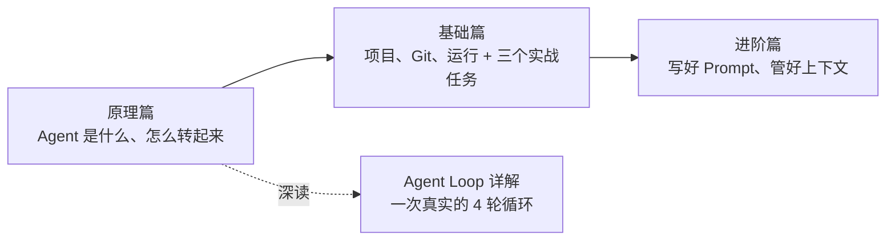

<div align="center">

# Coding Agent 教程

**写给所有人的 Coding Agent 中文入门与进阶指南：搞懂原理，上手干活，再用得高效。**

*A Chinese guide to coding agents — how they work, how to start, and how to use them well.*


</div>

## 这是什么

一套由浅入深的 Coding Agent 教程，共三篇，外加一篇 Agent Loop 深读。不假设你是研发，也不假设你用过任何 AI 工具：

- **完全没用过**：先弄清 Agent 到底是什么，再跟着三个真实任务亲手做一遍。
- **已经在用**：直接看进阶篇，学写好 Prompt、管好上下文，把 Agent 用得更快、更稳、更省。

正文以 **Codex App** 为主线举例（上手最简单），换成 Cursor、Claude Code，思路完全一样。

> [!NOTE]
> 教程最初在飞书撰写，本仓库是整理后的 Markdown 版本，配图已本地化，可在 GitHub 上直接阅读。

## 阅读路线



| 你是…… | 建议路线 |
| --- | --- |
| 第一次接触 AI coding 工具 | 原理篇 → 基础篇（动手做完三个任务）→ 使用一两周后读进阶篇 |
| 用过 ChatGPT，但没用过 Agent | 原理篇（重点读第二、三节）→ Agent Loop 详解 → 基础篇 |
| 已经在日常使用 coding agent | 进阶篇；概念模糊时回看原理篇第三节与 Agent Loop 详解 |

## 目录

### 01 · [原理篇：搞懂 Agent、Agent Loop 与 Coding Agent](01-%E5%8E%9F%E7%90%86%E7%AF%87/Agent%E7%9A%84%E5%8E%9F%E7%90%86.md)

整个系列的地基，回答"Agent 到底是什么、它凭什么能干活"。

1. **Agent 是什么**：和简单 API 调用、Workflow 的区别——有大脑、有手、还有自主意志。
2. **Agent Loop**：Think → Act → Observe 的核心循环。
3. **为什么强大，又有代价**：Loop 带来自我纠错，也让每一轮都在烧 token、让上下文膨胀。
4. **Coding Agent**：工具箱、IDE / App / CLI 三大产品形态，以及主流产品对比。

> **深读** · [Agent Loop 详解：10 分钟搞懂 AI Agent 的主循环](01-%E5%8E%9F%E7%90%86%E7%AF%87/agent-loop%E8%AF%A6%E8%A7%A3.md)
> 从"一次 API 调用长什么样"和 Tool Calling 讲起，用一个"删掉老板不要的按钮"的实战案例，逐轮拆解 4 次循环里的真实请求与响应：循环的油门和刹车、上下文为何一路膨胀、工具结果为何以用户消息回传。

### 02 · [基础篇：从零开始使用 Coding Agent](02-%E5%9F%BA%E7%A1%80%E7%AF%87/%E4%BB%8E%E9%9B%B6%E5%BC%80%E5%A7%8B%E4%BD%BF%E7%94%A8coding-agent.md)

先补齐几个"工程地基"概念，再用三个真实任务把它们用起来。

1. **项目与文件**：项目就是一个文件夹；路径与当前目录；纯文本 vs 富文本。
2. **版本管理与 Git**：用"游戏存档"理解 Git，你只需懂状态，命令交给 Agent。
3. **运行项目**：依赖与包管理、localhost 与端口、报错不是失败而是信息。
4. **上手三个真实任务**：批量整理重命名 → 把零散文件总结成文档 → 做一个可视化网页。
5. **隐私与数据红线**：本地跑 ≠ 数据没出去，以及按部门的敏感清单。

### 03 · [进阶篇：如何高效率使用 Coding Agent](03-%E8%BF%9B%E9%98%B6%E7%AF%87/%E5%A6%82%E4%BD%95%E9%AB%98%E6%95%88%E7%8E%87%E4%BD%BF%E7%94%A8coding-agent.md)

高效使用 Coding Agent 就是做好两件事：**写好 Prompt** 和 **管理好上下文**。

1. **写好 Prompt**：明白能力边界、Explore → Plan → Execute、给出有明确指向的线索、用 Skills 复用别人沉淀的经验。
2. **管理好上下文**：一个 Session 只做一件事、关注并主动压缩上下文、别往上下文里塞噪音、用 CLAUDE.md / Cursor Rules / AGENTS.md 沉淀经验。
3. **其他建议**：选适合你的、最好的模型。

## 配套练习素材

[`02-基础篇/配套素材/`](02-%E5%9F%BA%E7%A1%80%E7%AF%87/%E9%85%8D%E5%A5%97%E7%B4%A0%E6%9D%90/) 是基础篇第四章三个任务的练习材料：一个虚构「晨读 App」团队 2026 年 3 月的会议纪要、周报、复盘和 KPI 表格，故意弄得杂乱（命名五花八门，md / txt / csv / docx 混放）。

1. 克隆或下载本仓库，把 `配套素材/` **复制一份**再动手，原件留底。
2. 用 Codex App（或你顺手的工具）打开副本，按任务 A → B → C 依次完成。

素材只给原始文件，不提供标准答案，详见[素材说明](02-%E5%9F%BA%E7%A1%80%E7%AF%87/%E9%85%8D%E5%A5%97%E7%B4%A0%E6%9D%90/README.md)。

## 仓库结构

```text
.
├── 01-原理篇/
│   ├── Agent的原理.md
│   ├── agent-loop详解.md
│   └── images/
├── 02-基础篇/
│   ├── 从零开始使用coding-agent.md
│   ├── images/
│   └── 配套素材/           # 第四章练习用的虚构团队文件
├── 03-进阶篇/
│   ├── 如何高效率使用coding-agent.md
│   └── images/
├── LICENSE                 # CC BY 4.0
└── README.md
```

## 反馈与勘误

发现错别字、过时信息，或者有想补充的内容，欢迎提 [Issue](https://github.com/Helios5018/coding-agent-tutorial/issues)。工具和模型更新很快，文中的产品对比与模型建议以撰写时为准，使用时请以各产品官方文档为准。

## 许可证

本教程采用 [CC BY 4.0](LICENSE)（知识共享 署名 4.0 国际）许可：可以自由转载、翻译、改编，也可用于商业用途，只需注明出处并附上原仓库链接。
